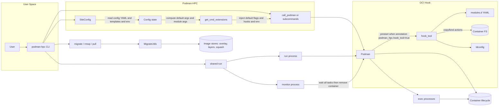
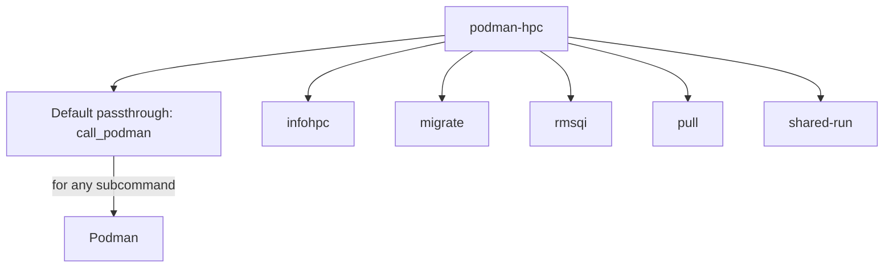
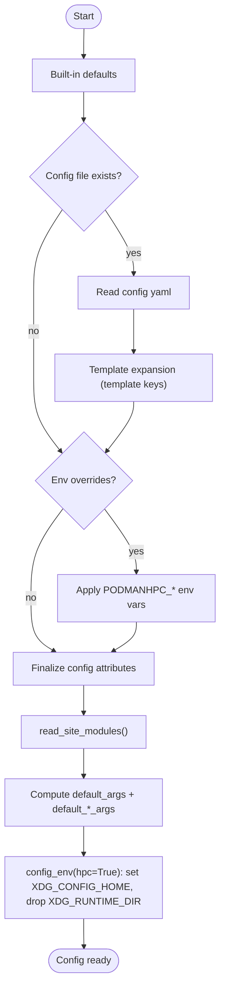
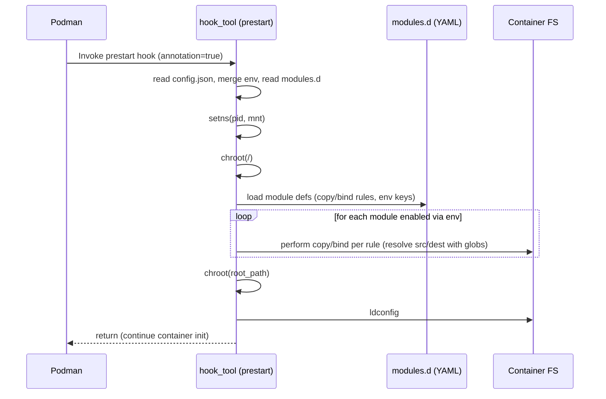
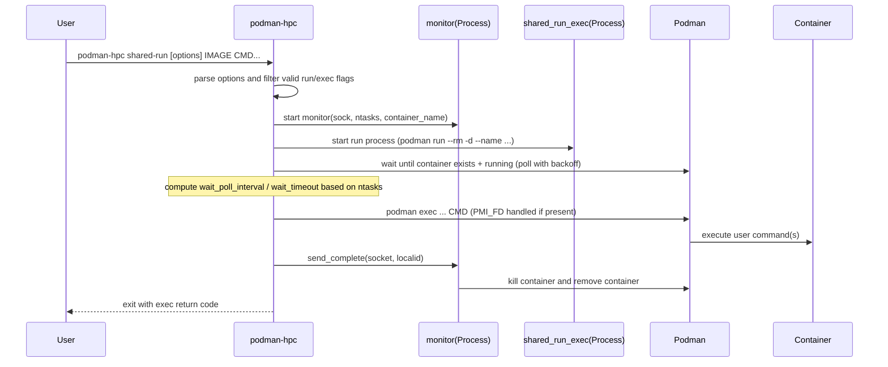
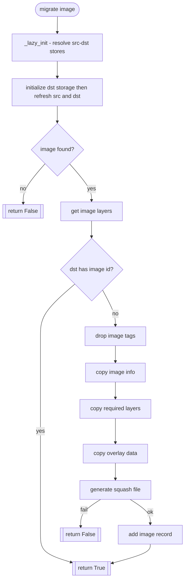
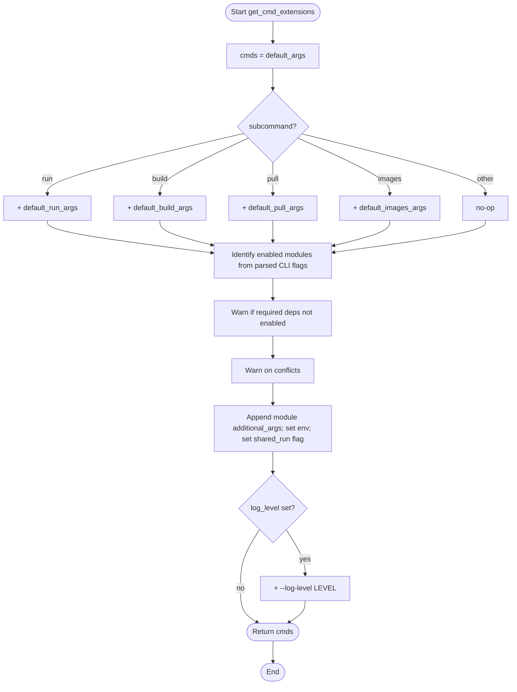

## Podman-HPC diagrams

This document provides a high-level, visual overview of how Podman-HPC works and the major tasks and code paths. Diagrams are written in Mermaid and render in many markdown viewers.

### 1) Architecture overview

### 2) CLI command structure

Key mappings:
- `call_podman`: wraps any `podman` subcommand and injects SiteConfig-derived flags.
- `infohpc`: prints version and resolved configuration.
- `migrate`: squashes an image into the squash store.
- `rmsqi`: removes a previously squashed image from the squash store.
- `pull`: pulls image via `podman`, then migrates on success.
- `shared-run`: starts one container per node and execs tasks into it.

### 3) Configuration precedence and environment setup

Source: `podman_hpc/siteconfig.py`

Notable outputs:
- Default flags for `run`, `build`, `pull`, `images`.
- Hooks enabled: `--hooks-dir`, `--annotation podman_hpc.hook_tool=true`, and `--env PODMANHPC_MODULES_DIR=...`.
- `additionalimagestore`: includes squash dir and optional stores.

### 4) OCI hook execution sequence

Source: `podman_hpc/configure_hooks.py`, `podman_hpc/hook_tool.py`

Module YAML keys used by hook:
- `name`, `env` (enable via env var)
- `copy`: file/dir copy rules
- `bind`: bind-mount rules

### 5) shared-run workflow (per node)

Source: `podman_hpc/podman_hpc.py::_shared_run`

PMI handling:
- If `PMI_FD` is set, dup to fd 3 and pass via `--preserve-fds 1`.

### 6) Migrate-to-scratch workflow

Source: `podman_hpc/migrate2scratch.py`

### 7) Module processing during command extension

Source: `podman_hpc/siteconfig.py::get_cmd_extensions`

Enabled module logic:
- A module is enabled when its `cli_arg` flag is present for the subcommand.
- Adds `additional_args`, sets `-e <ENV>=1`, and may set `shared_run=True`.
- Warnings are printed for missing `depends_on` and conflicting modules.

---

References:
- CLI and shared-run: `podman_hpc/podman_hpc.py`
- Config: `podman_hpc/siteconfig.py`
- Hook configuration: `podman_hpc/configure_hooks.py`
- Hook runtime: `podman_hpc/hook_tool.py`
- Migration utilities: `podman_hpc/migrate2scratch.py`

